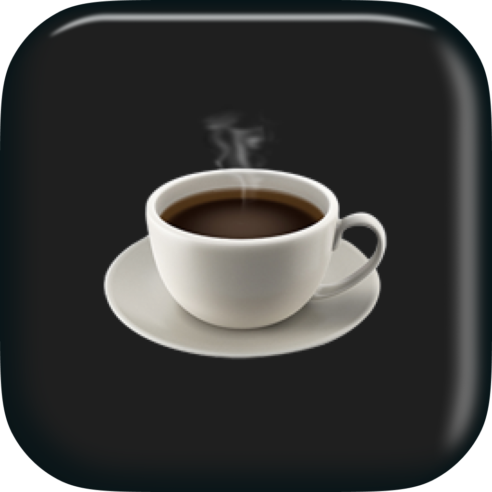

<p align="center"></p>

[![GitHub Actions][github-actions-src]][github-actions-href]
[](http://commitizen.github.io/cz-cli/)
[](https://img.shields.io/badge/platform-macOS-lightgrey.svg)
[](https://img.shields.io/badge/requirements-macOS%20Ventura+-ff69b4.svg)

# Barista

Barista is a sleek, lightweight menu bar manager for macOS that helps you declutter your menu bar by hiding items you don't need to see all the time. Also, if you activate caffeinated-mode, your computer will not sleep or dim.

> _Stay caffeinated & craft pretty menu bars._

## Features

- 🔄 **Menu Bar Manager** _Manage your menu bar with ease_
- ☕ **Caffeinate** _Caffeinate your Mac to prevent it from sleeping (or dimming)_
- 🍎 **Native macOS Experience** _Built with SwiftUI for a seamless Mac experience_
- ⚙️ **Customizable** _Choose which items to hide and when_
- ⏱️ **Auto-Hide** _Automatically hide items after a customizable delay_
- 🔑 **Global Hotkey** _Toggle visibility with a keyboard shortcut_
- 🚀 **Startup Launch** _Option to launch at login_
- 🌙 **Always-Hidden Section** _Keep certain items permanently hidden_
- 🌐 **RTL Support** _Full support for right-to-left languages_

## Auto-Updates

Barista includes automatic update functionality powered by [Sparkle](https://sparkle-project.org/). When a new version is released, users will be automatically notified and prompted to update.

### How It Works

1. The app periodically checks for updates from the GitHub repository
2. When an update is available, users receive a notification
3. Users can choose to install the update with a single click

### For Developers

To release a new version with auto-update support:

1. Make your changes and increase the version number
2. Create a new tag and push it to GitHub
3. GitHub Actions will automatically:
   - Build the application
   - Sign it for Sparkle updates
   - Create a release
   - Update the appcast.xml file

For more details on how to work with the auto-update system, see:

- [Sparkle Update Guide](docs/SPARKLE_UPDATES.md)
- [GitHub Release Guide](docs/GITHUB_UPDATES.md)

## Troubleshooting

### Build Issues

If you encounter build issues with dependencies like HotKey or Sparkle:

1. Run the dependency setup script:

   ```bash
   ./scripts/setup-dependencies.sh
   ```

2. For "No such module 'HotKey'" errors:
   - Reset Swift Package Manager caches in Xcode
   - See [Build Instructions](docs/BUILD_INSTRUCTIONS.md) for detailed steps

3. For Sparkle framework issues:
   - Make sure the Copy Frameworks build phase is added to your Xcode project
   - Check that the Sparkle framework is properly copied to the app bundle

For complete troubleshooting steps, see [Build Instructions](docs/BUILD_INSTRUCTIONS.md).

## How It Works

Barista adds a divider to your menu bar. Items to the right of the divider can be hidden with a single click, giving you a cleaner menu bar when you don't need those items.

<p align="center">
 
 
</p>

## Installation

<!-- ### App Store

[](https://itunes.apple.com/app/...) -->

### Homebrew

```bash
brew install --cask barista
```

### Manual Download

- [Download latest version](https://github.com/stacksjs/barista/releases/latest)
- Open and drag the app to the Applications folder
- Launch Barista and drag the icon in your menu bar (hold CMD) to position it where you want

## Usage

1. **Position the Icons**: Hold `⌘` (Command) and drag to arrange the Barista icons in your menu bar
2. **Hide Menu Items**: Click the arrow icon to hide items to the right of the divider
3. **Show Hidden Items**: Click the arrow icon again to reveal hidden items
4. **Access Settings**: Right-click the arrow icon to access preferences

## Requirements

- macOS Ventura (13.5) or later

## Contributing

We welcome contributions! Please feel free to submit a Pull Request.

## Credits

_Many thanks to..._

- [Hidden Bar](https://github.com/dwarvesf/hidden) for being the initial code inspiration
- [Bartender](https://www.macbartender.com)
- [Chris Breuer](https://github.com/chrisbbreuer)
- [All Contributors](../../contributors)

## Sponsors

We would like to extend our thanks to the following sponsors for funding Stacks development. If you are interested in becoming a sponsor, please reach out to us.

- [JetBrains](https://www.jetbrains.com/)
- [The Solana Foundation](https://solana.com/)

## License

The MIT License (MIT). Please see [LICENSE](LICENSE.md) for more information.

Made with 💙

<!-- Badges -->
[github-actions-src]: https://img.shields.io/github/actions/workflow/status/stacksjs/barista/ci.yml?style=flat-square&branch=main
[github-actions-href]: https://github.com/stacksjs/barista/actions?query=workflow%3Aci
