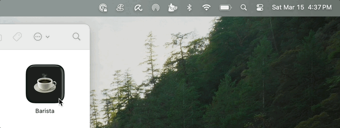

<p align="center"></p>

[![GitHub Actions][github-actions-src]][github-actions-href]
[](https://img.shields.io/badge/platform-macOS-lightgrey.svg)

# Barista

> Keep your Mac awake. One click from the menu bar.

Barista is a tiny, native macOS menu bar app that prevents your Mac from sleeping — a free, modern replacement for [Caffeine](https://lightheadsw.com/caffeine/), [Amphetamine](https://apps.apple.com/us/app/amphetamine/id937984704) and [KeepingYouAwake](https://github.com/newmarcel/KeepingYouAwake). One click to caffeinate, pick a duration (15m, 30m, 1h, 4h, 8h, 12h, or indefinite), and your Mac stays awake until you say otherwise. Built with [stx](https://github.com/stacksjs/stx) + [Craft](https://github.com/stacksjs/craft) so it stays out of the way: a 1.4MB native webview instead of a bundled browser, and under 100ms to a visible menu bar icon.

As a bonus, Barista also tidies up your menu bar.

## Why Barista

|                  | Barista        | Caffeine.app | Amphetamine     | KeepingYouAwake |
| ---------------- | -------------- | ------------ | --------------- | --------------- |
| Price            | Free, MIT      | Paid         | Free (Mac App Store) | Free, MIT  |
| Download         | ~20 MB         | ~3 MB        | ~15 MB          | ~5 MB           |
| Cold start       | <100 ms        | ~150 ms      | ~300 ms         | ~150 ms         |
| Runtime          | Native (Zig)   | Native       | Native          | Native          |
| Bonus: menu bar tidying | Yes     | No           | No              | No              |
| Source           | Open           | Closed       | Closed          | Open            |

## Features

- **Caffeinate, primarily** — Prevent system sleep, display sleep and idle sleep with customizable durations (15m, 30m, 1h, 4h, 8h, 12h, indefinite). **Left-click the cup** to brew or stop; the icon fills while your Mac is awake and the remaining time is on hover.
- **Right-click for everything else** — A native menu with the current status, the durations, the menu bar controls, preferences and updates.
- **Caffeinate on startup** — Optional: start the app already caffeinated, so your Mac is awake the moment you log in.
- **Global hotkey** — Toggle caffeinate (or the menu bar) without reaching for the mouse.
- **Menu bar management** *(bonus)* — Collapse and organize menu bar items, with optional auto-collapse and an always-hidden section.
- **Launch at login** — Start Barista when you log in.
- **Self-updating** — Checks its own GitHub releases, verifies the download by SHA-256, and can install and relaunch.
- **Native performance** — Craft's native webview does the rendering, so there is no bundled browser. Startup is under 100ms.
- **Beautiful UI** — Dark-themed popup window with intuitive controls.

## Get Started

```bash
bun install
bun run dev
```

## Development

```bash
# Run the app in development mode
bun run dev

# Lint
bun run lint
bun run lint:fix

# Build a distributable .app + .dmg (and a signed .pkg when signing is configured)
bun run build
```

## Architecture

Barista is a [stx](https://github.com/stacksjs/stx) menu bar app. `@stacksjs/stx`
is the only dependency — it wraps [Craft](https://github.com/stacksjs/craft), the
Zig-powered native webview, and the desktop APIs (power management, preferences,
system tray) behind one package.

`createMenuBarApp` from `@stacksjs/stx/menubar` owns the local server, the
preference store and the login item, so the app is a declaration rather than a
runtime:

```
app.ts                 createMenuBarApp: context, routes, tray menu
build.ts               Compile + package (DMG, and App Store .pkg when signed)
src/barista.stx        The popup — signals-driven, no vanilla DOM code
src/caffeinate.ts      Named wrapper over the desktop power API
src/tray.ts            The menu bar item: its cup icon and its menu
src/durations.ts       The durations the popup and tray both offer
src/preferences.ts     Preference shape and defaults
src/updates.ts         Self-update from GitHub releases
```

See the stx guide, [Menu Bar Apps](https://github.com/stacksjs/stx/blob/main/docs/guide/menubar.md),
for the pattern.

## Contributing

We welcome contributions! Please feel free to submit a Pull Request.

## Credits

- [Hidden Bar](https://github.com/dwarvesf/hidden) for being the initial code inspiration
- [Bartender](https://www.macbartender.com)
- [Chris Breuer](https://github.com/chrisbbreuer)
- [All Contributors](../../contributors)

## Sponsors

We would like to extend our thanks to the following sponsors for funding Stacks development. If you are interested in becoming a sponsor, please reach out to us.

- [JetBrains](https://www.jetbrains.com/)
- [The Solana Foundation](https://solana.com/)

## License

The MIT License (MIT). Please see [LICENSE](LICENSE.md) for more information.

Made with 💙

<!-- Badges -->
[github-actions-src]: https://img.shields.io/github/actions/workflow/status/stacksjs/barista/ci.yml?style=flat-square&branch=main
[github-actions-href]: https://github.com/stacksjs/barista/actions?query=workflow%3Aci
